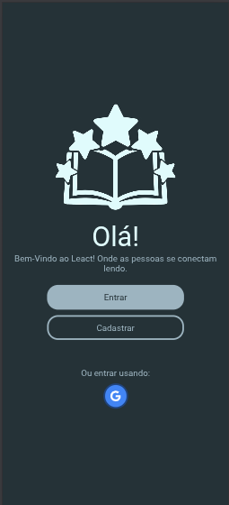
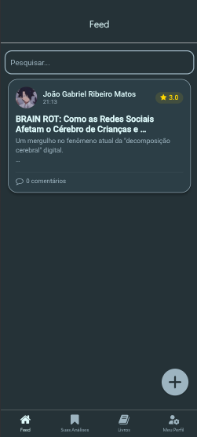

# LeactApp - Sistema de Apoio à Leitura

<p align="center">
  
</p>

O LeactApp é uma plataforma web responsiva desenvolvida para estimular o engajamento literário entre estudantes. O sistema permite que alunos interajam, redijam análises críticas sobre livros e artigos, e compartilhem percepções, criando um ambiente seguro e colaborativo focado no "universo do saber".

# Objetivos do Projeto

- Aumento da Leitura: Incentivar o consumo de livros e artigos técnicos/acadêmicos.
- Engajamento: Criar um espaço de debate sobre obras literárias.
- Interação: Conectar alunos através de análises críticas e trocas de conhecimento.
- Acessibilidade: Sistema 100% web e responsivo, acessível de qualquer dispositivo.

# Stack Técnica

- Mobile: [React Native](https://reactnative.dev/) com [Expo](https://expo.dev)
- Backend: [Supabase](https://supabase.com/) (PostgreSQL + Auth)
- Segurança: Row Level Security (RLS) & JWT
- Navegação: React Navigation

# Capturas de Tela

<div align="center">
  
   
   
</div>

# Como Executar o Projeto

**Pré-requisitos**: Ter o Node.js.

1. **Clone o repositório:**

```bash
git clone https://github.com/JJ0o0/LeactApp.git
cd LeactApp
```

2. **Instale as dependências:**

```bash
npm install
```

3. **Crie um arquivo .env na raiz usando o template dado.**

4. **Inicie o servidor do Expo:**

```bash
npx expo start
```

# Integrantes

- João Gabriel - Programador Principal.
- David Pietro - Programador do Banco de Dados
- Max Gois - Organizador dos Slides e Documentos.

# Licença

Esse projeto contém a licença do [MIT](./LICENSE)

---

Desenvolvido por: **Phosphorus Team** 2026
